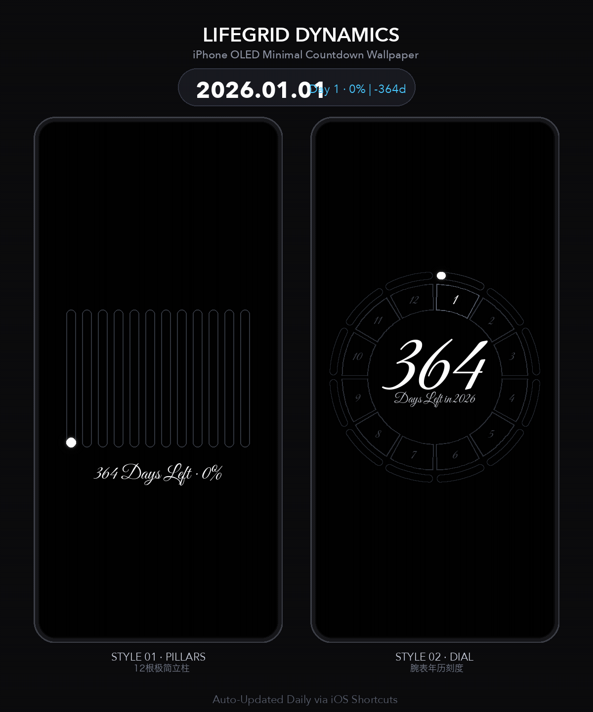
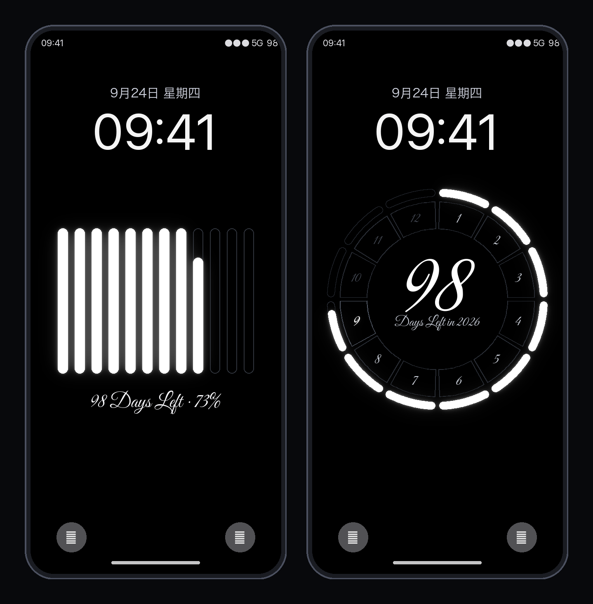
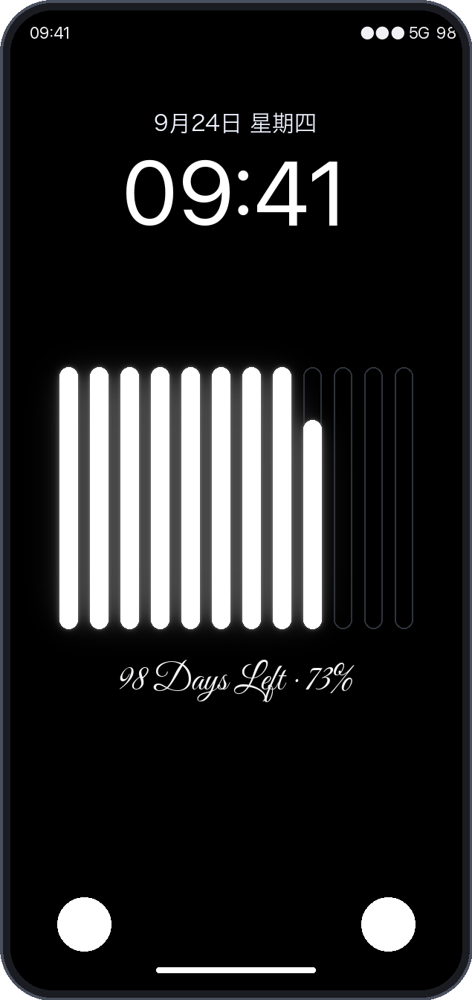
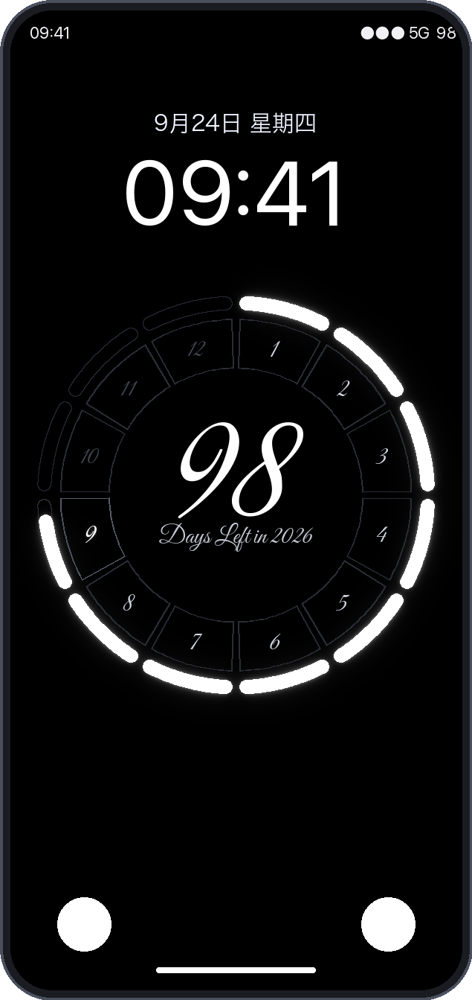
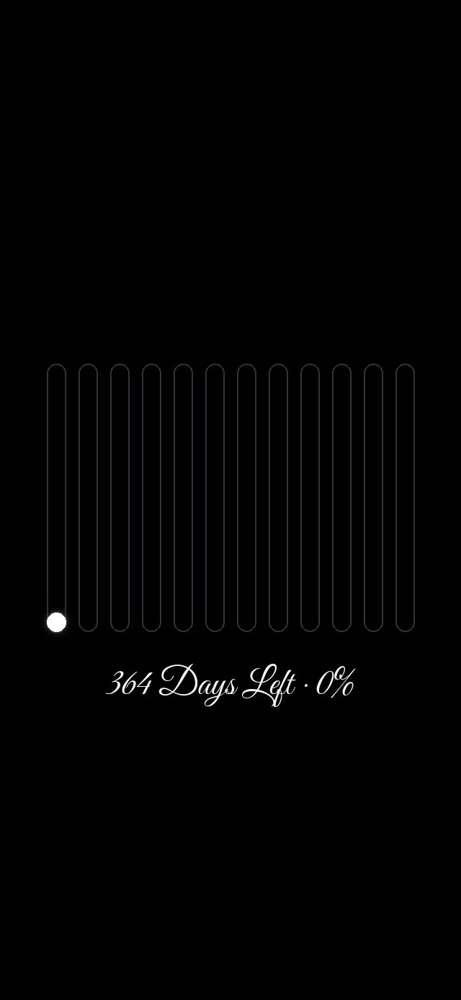
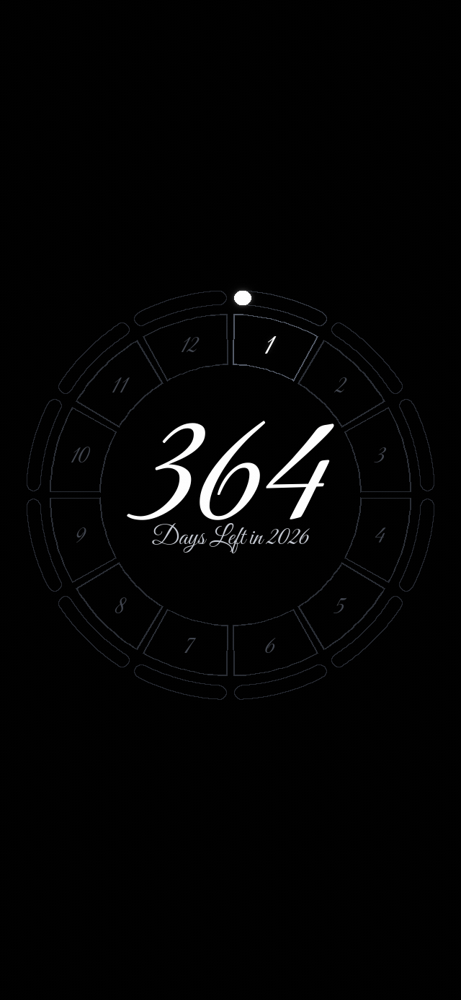

# PillarDial-Wall · 柱盘壁纸 | 12月度渐进充盈 iPhone 纯黑自律动态壁纸服务

<p align="center">
  
  
  
  
  
  
</p>

专为 iPhone OLED 屏幕设计的自律倒计时动态锁屏壁纸服务。告别让人产生密集焦虑与挫败感的 365 散点圆盘，以**瑞士高级腕表年历**与**宏观月度载体**为灵感，将时光沉淀为纯黑屏幕上的流光与刻度。

前几个月已满格点亮，当前月份随真实公历天数动态液位充盈，未来月份暗影待续。配合 **iOS 快捷指令自动化**，每天清晨静默拉取当天最新壁纸并替换锁屏，点亮屏幕即见时光流逝。

---

<p align="center">
  
  <br>
  <em>▲ 12 个月份随着真实天数渐进充盈 · 跨年元旦自动重置演进效果 (双样式 60fps 动态仿真)</em>
</p>

---

## 📸 设计核心样式与实机效果展示

本项目精准实现并还原了两种标志性的时间美学设计，完美避让 iPhone 灵动岛、锁屏时钟与底部快捷键：

<p align="center">
  
  <br>
  <em>▲ iPhone 16 Pro 真机锁屏实景适配海报 (左: Style 1 时间立柱 · 右: Style 3 瑞士年历盘)</em>
</p>

### 样式对比与全年演进动效

| 样式 1: 时间立柱液位计 (Monolithic Pillars) | 样式 3: 瑞士腕表年历盘 (Chronometer Dial) |
| :---: | :---: |
|  |  |
|  |  |
| **12 根纵向胶囊立柱** 并排居中，宛如物理液位计。<br>• 过去月份 100% 充盈纯白实体光芒；<br>• 当前月份按当月天数进度从底部向上升起；<br>• 未来月份深灰线框静候光阴；<br>• 底端大字排印剩余天数与年度进度百分比。 | **12 扇区分割的天体年历圆环** 罗盘，致敬制表工艺。<br>• 12 点钟顺时针运转，月份数字清晰呼应；<br>• 当前月份动态弧形胶囊流光充盈；<br>• 中央黄金比例大字排印剩余天数；<br>• 纯黑 OLED 深度黑，尽显机械腕表的高级感。 |

> 🌐 **关于在线体验网址**：  
> 官方公共演示站点与快捷指令直装服务正在完成域名备案与自动化边缘节点部署，将在近期随新版本正式公开！目前您可以通过下方教程在本地或私有服务器通过 Docker / Python 一键启动运行。

---

## ✨ 核心特性

- 📱 **纯黑 OLED 深度优化（#000000）**：完美发挥 iPhone Super Retina XDR 屏幕省电特性，所有发光图元精准避让锁屏时间区、灵动岛与底部快捷手电筒/相机图标，绝无视觉遮挡。
- 🔄 **双端双模驱动（云端 API + 本地秒级客户端）**：
  - **云端服务 (FastAPI)**：支持超低延迟请求、2x 超采样抗锯齿渲染与 HTTP ETag 强缓存，无缝对接 iOS 快捷指令全自动更新。
  - **本地客户端 (`client.html`)**：手机访问自动识别定向，100% 在 iPhone 本地浏览器由 GPU 原生秒级绘制，支持长按直接存储到“照片”，更省流量与电量。
- 📐 **全机型原生像素级适配**：
  - 内置 iPhone 18 全系列（Pro Max / Pro / Air / Fold 概念）、iPhone 17 系列、iPhone 16 系列、iPhone 15 / 14 / 13 / 12 / mini 及 SE 等 **30+ 款机型**原生点阵与分辨率预设。
- 🛡️ **严格的合规与开源字体策略**：
  - 默认全量采用符合 **SIL Open Font License (OFL 1.1)** 国际开源自由协议的商用免费字体（如顶级连笔艺术花体 `Great Vibes`、古典羽毛笔花体 `Pinyon Script` 等），彻底杜绝字体商业版权侵权风险。
  - 云端不分发、不存储任何商业专有字体（如 Zapfino、Helvetica 等），若用户追求原生系统书法，可由本地客户端调用 iOS 自带底层字体安全绘制。
- ⚡ **高性能双层缓存**：
  - 内置基于参数哈希的 LRU 内存缓存与 ETag 响应头，相同机型同一天的请求**零重复计算**，毫秒级直接回传 PNG 字节流。

---

## 🚀 快速启动

### 方式一：本地 Python 启动（推荐用于二次开发）

```bash
# 1. 克隆仓库
 git clone https://github.com/NeverRookie/PillarDial-Wall-.git
 cd PillarDial-Wall-

# 2. 创建并激活虚拟环境 (可选)
python3 -m venv venv
source venv/bin/activate  # macOS / Linux
# venv\Scripts\activate   # Windows

# 3. 安装依赖
pip install -r requirements.txt

# 4. 启动服务 (默认端口 8088)
uvicorn app.main:app --host 0.0.0.0 --port 8088 --reload
```

启动后在浏览器打开：
- 电脑端控制台：`http://localhost:8088/`（支持交互调参、机型匹配与点击即时静态预览）
- 手机端轻量页：`http://localhost:8088/client.html`

---

### 方式二：Docker & Docker Compose 一键部署（推荐用于云服务器）

项目内置了生产级 Dockerfile 与 docker-compose 编排文件：

```bash
# 进入部署目录
cd deploy

# 一键构建并后台启动
docker-compose up -d
```

---

### 方式三：静态轻量部署（纯前端客户端模式，零后端）

如果您没有云服务器，也可以将 `static/` 目录中的文件（`client.html`、`canvas-engine.js`、`style.css`）直接部署至 **GitHub Pages**、**Vercel** 或 **Cloudflare Pages**：
- 用户用手机打开网页即可离线秒出高清壁纸，长按直接保存并手动设为壁纸。

---

## ⚡ iOS 快捷指令全自动每日换壁纸教程（仅需 2 步）

按照以下步骤配置后，每天早晨 iPhone 会在后台静默自动拉取当天最新壁纸并替换锁屏，彻底解放双手：

### 步骤 1：创建「自动换壁纸」快捷指令

1. 打开 iPhone 自带的 **「快捷指令」** App，点击右上角 **「+」** 新建快捷指令；
2. 将顶部名称改为：`DuanLife 每日壁纸`；
3. 点击 **「添加操作」** ➔ 搜索并添加：**「获取 URL 的内容」**；
4. 在 URL 输入框中粘贴您的专属壁纸地址（在 Web 控制台可一键生成并复制），例如：  
   `http://<您的服务器IP或域名>/download?style=dial&model=iphone16pro&font=greatvibes`
5. 点击下方搜索并添加：**「设定墙纸」**；
6. 点击该卡片展开小箭头（高级选项）：
   - 将目标设为：**「锁定屏幕」**（或锁屏+主屏幕）；
   - **⚠️ 关键设置**：将 **「显示预览」关闭**（关闭后才能在后台静默替换，不弹窗打扰）；
7. 点击右下角运行测试（首次弹出授权提示请点击**“始终允许”**），锁屏成功换好后点击右上角 **「完成」** 保存。

### 步骤 2：设置每日清晨全自动定时触发

1. 在「快捷指令」App 底部切换到 **「自动化」** 标签页；
2. 点击右上角 **「+」**（新建个人自动化）；
3. 触发条件选择：**「特定时间」**：
   - 时间建议设为清晨，例如：`06:30`；
   - 重复周期勾选：`每天`；
   - **⚠️ 关键设置**：勾选 **「立即运行」**，并在下方将 **「运行时通知」关闭**（实现无感静默执行）；
4. 点击“下一步”，在列表中选取第一步创建的快捷指令：`LifeGrid 每日壁纸`；
5. 点击右上角 **「完成」** 保存！

🎉 **大功告成**：从明天开始，每天清晨手机会在后台自动换好当天的生命倒数壁纸！

---

## 📡 API 开发者调用手册

后端基于 FastAPI 构建，遵循 RESTful 规范，接口返回标准 `image/png` 二进制图片流。

### 1. 实时壁纸流 `/generate` 或 `/download`

- **请求方式**：`GET` / `HEAD`
- **返回格式**：`image/png`（支持 HTTP 304 Not Modified 缓存协商）

#### 请求参数：

| 参数名 | 类型 | 默认值 | 可选值 / 说明 |
| :--- | :--- | :--- | :--- |
| `style` | string | `dial` | 壁纸样式：`dial`（样式3: 瑞士腕表年历盘 · 推荐）或 `pillars`（样式1: 时间立柱液位计） |
| `model` | string | `iphone16` | iPhone 预设机型标识（如 `iphone16pro`, `iphone16promax`, `iphone17air` 等） |
| `font` | string | `greatvibes` | 数字排印字体：`greatvibes`（开源顶级艺术花体 · 推荐）、`pinyon`（开源古典花体）、`avenir`（现代几何）、`sf`（苹果系统原生） |
| `lang` | string | `en` | 文案语言：`en`（英文 · 推荐）或 `zh`（简体中文） |
| `bg` | string | `000000` | 十六进制背景色（不含 `#`，默认纯黑 OLED） |
| `accent` | string | `FFFFFF` | 十六进制充盈强调色（不含 `#`，默认纯白发光） |
| `download`| bool | `false` | 为 `true` 时响应头附加 `Content-Disposition: attachment` 直接触发浏览器下载 |
| `date` | string | 当日 | 测试指定日期，格式 `YYYY-MM-DD`（如 `2026-12-31`） |

#### 调用示例：

```bash
# 获取 iPhone 16 Pro 当天样式 3 (腕表年历盘) 壁纸
curl "http://localhost:8088/generate?style=dial&model=iphone16pro&font=greatvibes" -o today_dial.png

# 获取 iPhone 16 当天样式 1 (时间立柱) 壁纸
curl "http://localhost:8088/generate?style=pillars&model=iphone16" -o today_pillars.png

# 快捷指令专用下载接口 (直接返回下载流)
curl -L "http://localhost:8088/download?style=dial&model=iphone16pro" -o download.png
```

### 2. 状态查询与机型列表

- `GET /health`：查看服务运行健康度与系统当前时间戳。
- `GET /models`：获取服务端完整支持的所有 30+ 款 iPhone 机型列表及其像素宽高信息。

---

## 📂 项目目录结构

```text
lifegrid-wallpaper/
├── app/                        # 服务端核心后端 (FastAPI)
│   ├── main.py                 # API 路由、缓存协商与应用入口
│   ├── generator.py            # PIL 高清矢量渲染引擎 (Style 1 & 3 算法实现)
│   ├── models_db.py            # 30+ 款 iPhone 分辨率、避让尺寸与 PPI 数据
│   └── cache.py                # 内存 LRU 缓存与 ETag 计算
├── static/                     # 前端 Web 交互与轻量客户端
│   ├── index.html              # 电脑端交互控制台 (真机静态预览与调参)
│   ├── client.html             # iPhone 本地 GPU 极速渲染轻量客户端
│   ├── canvas-engine.js        # 纯前端 Canvas 矢量绘制引擎 (跨平台圆角兼容)
│   ├── app.js                  # 前端交互、设备分辨率智能侦测与 URL 生成
│   └── style.css               # OLED 纯黑视觉样式表
├── assets/                     # 静态资源与字体库
│   └── fonts/                  # 符合 SIL OFL 开源许可的商用免费字体
│       ├── GreatVibes-Regular.ttf
│       ├── PinyonScript-Regular.ttf
│       └── ...
├── deploy/                     # 容器化与运维部署配置
│   ├── Dockerfile              # Docker 镜像构建脚本
│   ├── docker-compose.yml      # 一键容器编排
│   ├── nginx.conf              # Nginx 生产反向代理与 Gzip 缓存配置
│   └── cloudflare_worker.js    # Cloudflare 边缘计算代理脚本
├── tests/                      # 自动化测试套件
│   └── test_local_download.py  # 接口与渲染集成测试
├── .gitignore                  # Git 忽略配置 (含字体防侵权与隐私信息屏蔽)
├── requirements.txt            # Python 依赖清单
└── README.md                   # 项目完整开源说明文档
```

---

## ⚖️ 免责声明与版权商标说明 (Legal Notice & Disclaimer)

1. **独立第三方开源项目**：本项目为独立的开源个人自律与时间美学可视化工具，与 Apple Inc.（苹果公司）无任何商业附属、赞助、合作或官方背书关系。
2. **商标权属**：文中所提及之 `iPhone`、`iOS`、`快捷指令 (Shortcuts)`、`Retina`、`灵动岛 (Dynamic Island)` 均为 Apple Inc. 在美国及其他国家/地区的注册商标，此处提及仅用于设备兼容性说明与客观事实描述（Nominative Fair Use）。
3. **字体开源合规承诺**：本项目云端分发的默认字体均严格遵循 **SIL Open Font License (OFL 1.1)** 国际开源字型许可协议，允许免费商用与自由分发。本项目杜绝分发任何未获商业再分发授权的商业专有字体（如 Zapfino®、Helvetica® 等），保护创作者与使用者远离版权法律纠纷。
4. **使用条款**：本项目按“现状”（As-Is）原则提供，免费供个人自律生活与技术学习使用。

---

## 📄 开源许可证

本项目基于 [MIT License](LICENSE) 协议开放源代码，欢迎提交 Issue 与 Pull Request 共同改进！
